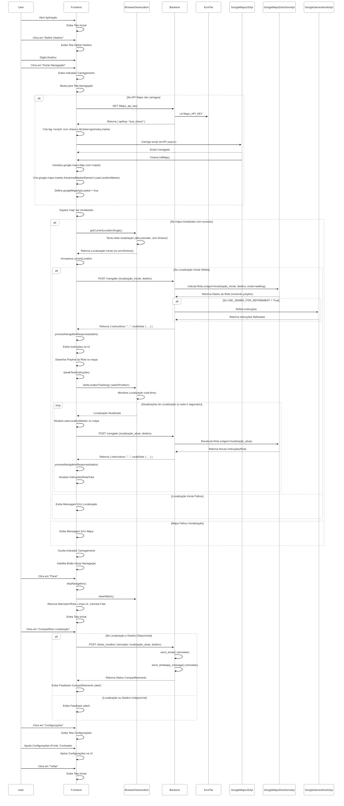
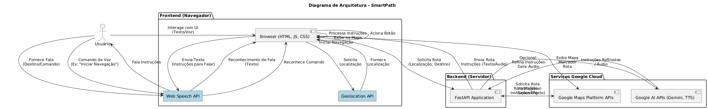
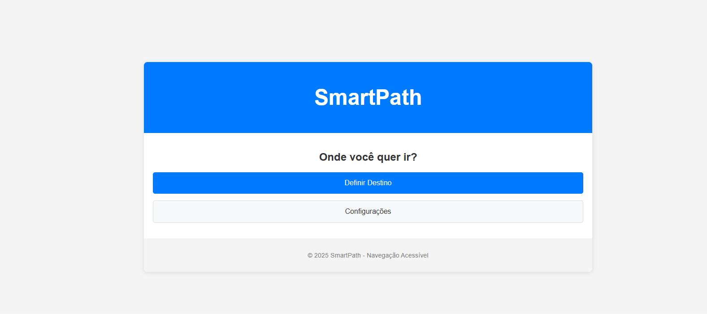
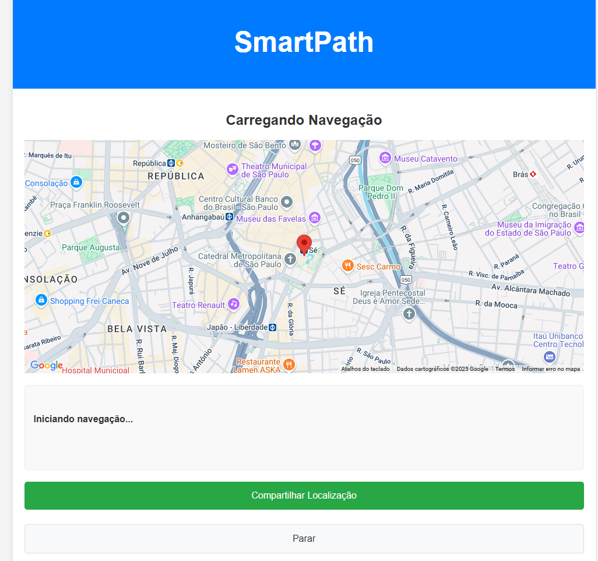
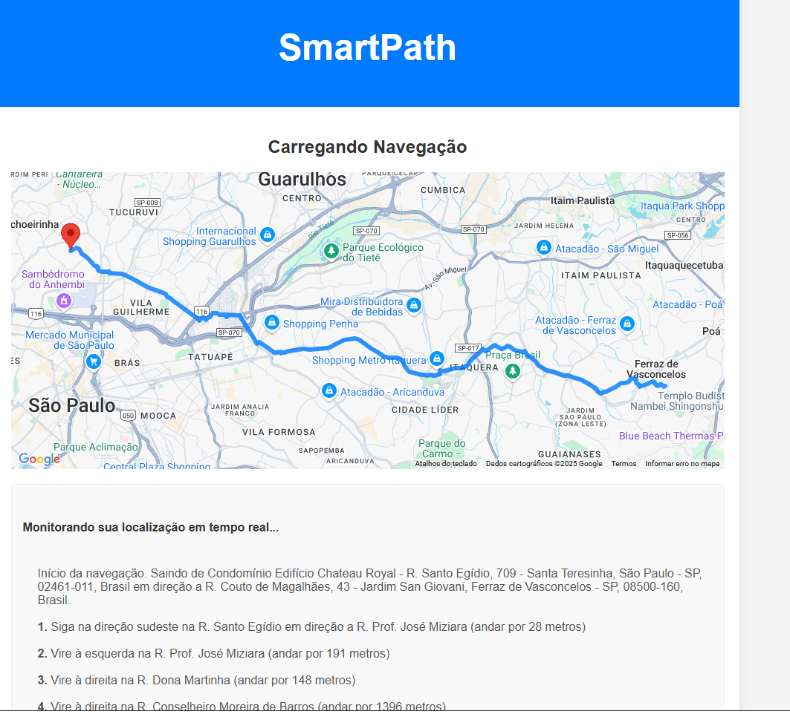

# SmartPath - Navegação Acessível

## Descrição do Projeto

SmartPath é um protótipo de aplicação web para navegação acessível, projetado com o objetivo principal de **auxiliar pessoas com deficiência visual** a navegar em ambientes urbanos de forma mais **autônoma e independente**. Desenvolvido como um projeto conceito durante a Imersão IA com Google Gemini da Alura, o SmartPath utiliza uma combinação de APIs e tecnologias web para fornecer uma experiência de navegação simplificada e inclusiva.

A aplicação integra a API de Geolocalização do navegador para obter a localização em tempo real do usuário, a API do Google Maps para exibir o mapa e a rota visualmente, e um backend em Python (FastAPI) que se comunica com as APIs do Google Maps Directions e, opcionalmente, a API do Google Gemini, para calcular rotas e gerar instruções de navegação claras e acessíveis.

Um foco significativo do projeto é a **interação sem digitação** e as **funcionalidades de acessibilidade no frontend**, garantindo que usuários com diferentes necessidades possam interagir com a aplicação facilmente.

## Funcionalidades

* **Definição de Destino por Voz ou Texto:** Permite que o usuário insira o destino desejado **tanto digitando quanto falando**, oferecendo flexibilidade e facilitando a interação.
* **Comando de Voz para Iniciar Navegação:** Além de preencher o destino, o usuário pode usar **comandos de voz específicos** (como "iniciar navegação" ou "navegar") para automaticamente acionar o início da rota, proporcionando uma experiência mais fluida.
* **Obtenção e Acompanhamento de Localização:** Utiliza a API de Geolocalização do navegador para obter a localização atual do usuário em tempo real, com lógica para um fix inicial mais preciso e acompanhamento contínuo.
* **Visualização de Mapa Interativo:** Exibe um mapa dinâmico utilizando a Google Maps JavaScript API, mostrando a localização do usuário e a rota planejada.
* **Marcador de Usuário Avançado:** Mostra a localização atual do usuário no mapa utilizando um Marcador Avançado (`AdvancedMarkerElement`) para melhor visibilidade.
* **Cálculo e Exibição de Rota Acessível:** Comunica-se com o backend (Python/FastAPI) para calcular a rota a pé até o destino, exibindo a polilinha no mapa.
* **Instruções de Navegação Passo a Passo:** Recebe as instruções detalhadas da rota do backend e as exibe na tela em um formato claro e sequencial.
* **Text-to-Speech (Fala das Instruções):** Utiliza a Web Speech API (Text-to-Speech) para **falar as instruções de navegação passo a passo**, permitindo que o usuário ouça as direções sem precisar olhar constantemente para a tela.
* **Configurações de Acessibilidade Visual:** Inclui opções no frontend para que o usuário ajuste o **tamanho da fonte** do texto e alterne entre um **tema visual normal e um de alto contraste**, melhorando a legibilidade para usuários com baixa visão ou outras necessidades visuais.
* **Compartilhamento de Localização/Rota (Em Desenvolvimento):** Funcionalidade conceitual para compartilhar a localização atual ou os detalhes da rota (via email ou WhatsApp). *Observação: A implementação real do envio via email/WhatsApp depende de serviços externos e APIs específicas não cobertas neste protótipo principal.*
* **Indicador de Carregamento Visual:** Feedback visual durante o processamento da rota ou outras operações.

## Tecnologias Utilizadas

* **Frontend:**
    * HTML5
    * CSS3 (com variáveis CSS para temas)
    * JavaScript (ES6+)
    * Web Speech API (Speech Recognition e Text-to-Speech)
    * Google Maps JavaScript API (incluindo Advanced Markers)
    * API de Geolocalização do Navegador
* **Backend (Python com FastAPI):**
    * FastAPI
    * `requests` (para chamadas a APIs externas)
    * `python-dotenv` (para gerenciar variáveis de ambiente)
    * `google-generativeai` (opcional, para integração com Google Gemini)
    * `googlemaps` (Biblioteca cliente Python para Google Maps Platform APIs)
    * `re` (para processamento de texto)
    * `google-cloud-texttospeech` (Opcional, se usar TTS no backend)
    * CORS Middleware
* **APIs do Google Cloud Platform:**
    * Google Maps Directions API
    * Google Maps Geocoding API (usada implicitamente pela biblioteca googlemaps)
    * Google Maps JavaScript API
    * Google Gemini API (opcional, se configurado e usado)
    * Google Cloud Text-to-Speech API (opcional)

## GitHub Pages:
https://guilhermenuneslopes.github.io/ProjetoSmartPath/

## Configuração e Execução

Para configurar e rodar o SmartPath localmente, siga os passos abaixo:

### Pré-requisitos

* Python 3.7+
* Uma conta Google Cloud com as APIs Google Maps Directions, Geocoding, JavaScript, e opcionalmente Gemini e Text-to-Speech habilitadas.
* Chaves de API do Google Cloud: Uma chave para o backend (Directions, Geocoding, Gemini, TTS - restrinja por IP) e outra para o frontend (JavaScript API - restrinja por HTTP referrer).
* Node.js e npm (opcional, se você usar ferramentas de build frontend ou servir via Node.js)
* Conexão com a internet (essencial para as APIs do Google e reconhecimento de voz online)


### Backend Setup

1.  Clone ou baixe os arquivos do projeto.
2.  Navegue até a pasta do backend (`main.py`).
3.  Crie um ambiente virtual (opcional, mas recomendado):
    ```bash
    python -m venv .venv
    source .venv/bin/activate  # No Windows, use `.venv\Scripts\activate`
    ```
4.  Instale as dependências do Python:
    ```bash
    pip install fastapi uvicorn python-dotenv googlemaps google-generativeai requests
    ```
5.  Crie um arquivo `.env` na mesma pasta do `main.py` com suas chaves de API:
    ```env
    GOOGLE_API_KEY="SUA_CHAVE_API_GOOGLE_GEMINI"
    Maps_API_KEY="SUA_CHAVE_API_Maps"
    ```
    Substitua `"SUA_CHAVE_API_GOOGLE_GEMINI"` e `"SUA_CHAVE_API_Maps"` pelas suas chaves reais. A `Maps_API_KEY` será usada no backend para a Directions API e fornecida ao frontend.
6.  Execute o servidor FastAPI:
    ```bash
    uvicorn main:app --reload
    ```
    O backend estará rodando em `http://127.0.0.1:8000`.

### Frontend Setup

1.  Navegue até a pasta dos arquivos do frontend (`index.html`, `script.js`, `style.css`).
2.  Você precisa servir esses arquivos estaticamente. A maneira mais simples para desenvolvimento é usar um servidor web simples do Python:
    ```bash
    cd caminho/para/sua/pasta/frontend
    python -m http.server 8000 ```
    
**(Nota: Se o backend já está rodando na porta 8000, use outra porta para o frontend, como 8080: `python -m http.server 8080`. Certifique-se de que a URL do backend no `script.js` (`http://127.0.0.1:8000`) esteja correta).**

3.  Abra seu navegador e acesse `http://localhost:8000` (ou a porta que você usou para o servidor estático do frontend).

### Configuração do Google Cloud

* No Google Cloud Console, associe seu Map ID a um Map Style. O Map ID é necessário para que os Advanced Markers funcionem. Substitua `'YOUR_MAP_ID_HERE'` no `script.js` (na função `initMap`) pelo seu Map ID real. Para testes, `'DEMO_MAP_ID'` pode funcionar, mas com limitações.
* Restrinja suas chaves de API no Google Cloud Console por HTTP referrer (para a chave usada no frontend) e por IP (para a chave usada no backend no servidor).

## Fluxo de Funcionamento

O diagrama abaixo ilustra a interação entre os componentes da aplicação:


## Fluxo de Funcionamento - Diagrama





## Exemplos das Telas




*O Frontend coleta a localização do usuário (Geolocalização API) e o destino (Input de Texto ou **Reconhecimento de Fala**).
*Envia a localização e destino para o Backend.
*O Backend usa as APIs do Google Maps para calcular a rota e obter instruções, e opcionalmente refina as instruções com Gemini ou gera áudio com Cloud TTS.
*O Backend envia a rota e as instruções (texto/áudio) de volta para o Frontend.
*O Frontend exibe a rota no mapa (Google Maps JS API), mostra as instruções visuais e as fala (Web Speech API TTS).
*O Frontend gerencia as **configurações de acessibilidade** e responde a comandos de voz (via **Speech Recognition API**) para iniciar a navegação.

## Funcionalidades de Acessibilidade Detalhadas

* **Reconhecimento de Voz:** Permite a interação principal para definir o destino e **iniciar a navegação** sem a necessidade de usar o teclado, beneficiando usuários com dificuldades motoras ou visuais. Inclui feedback visual na tela sobre o status do reconhecimento.
* **Text-to-Speech (Fala das Instruções):** Fornece as instruções de navegação em áudio, crucial para usuários com deficiência visual navegarem de forma independente.
* **Ajuste de Tamanho da Fonte:** Permite que o usuário aumente ou diminua o tamanho do texto na interface para melhor legibilidade.
* **Modo de Alto Contraste:** Oferece um tema de cores com alto contraste para melhorar a visibilidade para usuários com certas condições visuais.
* **Design Responsivo (Básico):** A interface se adapta a diferentes tamanhos de tela (desktops, tablets, celulares), embora a navegação detalhada em tempo real possa exigir mais refinamentos em dispositivos móveis.
* **Uso Básico de Semântica HTML e ARIA:** Utilização de tags HTML semânticas e atributos ARIA básicos para auxiliar leitores de tela (ex: `aria-label`, `aria-live`). *Observação: Mais atributos ARIA podem ser adicionados para aprimorar a experiência com leitores de tela.*
* **Feedback Visual de Interação:** Estados de `hover` e `focus` claros para botões e campos de input, auxiliando na navegação por teclado e para usuários com dificuldades de coordenação motora.

## Status do Projeto

Este é um protótipo conceitual. As funcionalidades principais (obter localização, definir destino por voz/texto, obter e exibir rota e instruções, falar instruções, ajustes de acessibilidade visual, comando de voz para iniciar) estão implementadas. Funcionalidades como compartilhamento real (email/WhatsApp) e o refinamento completo das instruções pelo Gemini dependem de configuração adicional e/ou estão simuladas.

## Próximos Passos Potenciais

* Implementar o compartilhamento de localização/rota via serviços reais.
* Refinar a integração com Google Gemini para gerar instruções ainda mais naturais e adaptadas (ex: descrever pontos de referência acessíveis).
* Melhorar a precisão e o feedback do reconhecimento de voz, talvez explorando `continuous: true` e gerenciando as frases reconhecidas em tempo real.
* Adicionar mais comandos de voz (ex: "Onde estou?", "Próxima instrução").
* Explorar outras APIs do Google Maps Platform (ex: Street View, Indoor Maps para navegação interna se aplicável).
* Aprimorar a experiência com leitores de tela adicionando mais atributos ARIA e garantindo que todos os elementos interativos sejam acessíveis via teclado.
* Desenvolver um design mais robusto e testado com usuários reais com deficiência visual.

## Contribuições

Contribuições são bem-vindas! Se você tiver sugestões de melhoria ou quiser contribuir com código, sinta-se à vontade para abrir uma issue ou enviar um Pull Request.

## Licença

[Indicar o tipo de licença do seu projeto, ex: MIT, Apache, etc.]

## Autor

Guilherme Lopes + Gemini

---

*Desenvolvido durante a Imersão IA com Google Gemini da Alura.*
